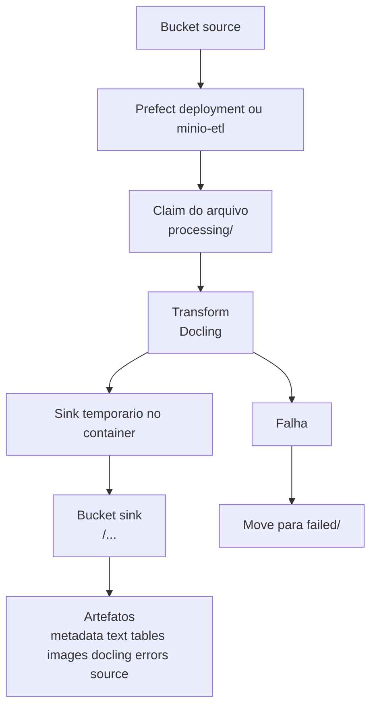

# Extract PDF Document

[](https://github.com/paulossjunior/extract_pdf_document/actions/workflows/docker-publish.yml)
[](https://github.com/paulossjunior/extract_pdf_document/releases)
[](https://github.com/paulossjunior/extract_pdf_document)

Pipeline ETL em Python para extrair dados de PDFs e imagens com Docling, separando a saida em texto, tabelas e imagens.

Fluxo principal:

```text
MinIO source bucket -> Docling transform -> MinIO sink bucket
```

## O que o projeto faz

- le documentos PDF/imagem do bucket `source`
- reserva os arquivos movendo da raiz do bucket para `processing/`
- usa Docling para interpretar o documento
- grava o resultado no bucket `sink`, isolado por `document_id`
- remove o objeto de `processing/` quando o processamento termina com sucesso
- move o objeto para `failed/` quando ha erro
- recupera automaticamente objetos orfaos em `processing/` quando ficam parados alem do timeout de recuperacao
- aplica um perfil completo em lotes para PDFs muito grandes, processando o documento inteiro por faixas de paginas para preservar texto, tabelas e imagens com mais estabilidade

## Arquitetura



Fluxo de objetos no bucket de entrada:

- raiz do bucket: arquivos novos aguardando processamento
- `processing/`: arquivos em processamento
- `failed/`: arquivos que falharam

Fluxo de objetos no bucket de saida:

- `<document_id>/metadata.json`
- `<document_id>/text/...`
- `<document_id>/tables/...`
- `<document_id>/images/...`
- `<document_id>/docling/...`
- `<document_id>/errors/...`
- `<document_id>/source/<arquivo-original>`

## Requisitos

- Python 3.10+
- Docker e Docker Compose, se quiser rodar via container

Dependencias Python:

- `docling`
- `minio`
- `pandas`
- `prefect`
- `pydantic`

## Instalacao local

```bash
python3.12 -m venv .venv
source .venv/bin/activate
python -m pip install --upgrade pip
python -m pip install -e .
```

## Configuracao MinIO

Variaveis principais:

- `MINIO_ENDPOINT`: endpoint S3, exemplo `localhost:9000`
- `MINIO_ACCESS_KEY`: usuario do MinIO
- `MINIO_SECRET_KEY`: senha do MinIO
- `MINIO_SOURCE_BUCKET`: bucket de entrada, padrao `source`
- `MINIO_SINK_BUCKET`: bucket de saida, padrao `sink`
- `MINIO_SOURCE_PREFIX`: prefixo opcional de entrada; por padrao vazio para processar a raiz do bucket
- `MINIO_PROCESSING_PREFIX`: prefixo de claim, padrao `processing/`
- `MINIO_FAILED_PREFIX`: prefixo de falha, padrao `failed/`
- `MINIO_PROCESSING_RECOVERY_TIMEOUT_SECONDS`: tempo em segundos para retomar arquivos presos em `processing/`, padrao `300`
- `MINIO_SINK_PREFIX`: prefixo opcional dentro do bucket sink
- `LOG_DIR`: pasta local de logs, padrao `log`
- `LARGE_DOCUMENT_PAGE_THRESHOLD`: acima desse numero de paginas o PDF entra em processamento por lotes, padrao `200`
- `LARGE_DOCUMENT_SIZE_MB_THRESHOLD`: acima desse tamanho o PDF entra em processamento por lotes, padrao `20`
- `LARGE_DOCUMENT_TIMEOUT`: timeout por lote no perfil de documento grande, padrao `900`
- `LARGE_DOCUMENT_PAGE_CHUNK_SIZE`: quantidade de paginas por lote para PDFs grandes, padrao `25`
- `PREFECT_ETL_INTERVAL_SECONDS`: intervalo da agenda do deployment Prefect, padrao `10`
- `PREFECT_DEPLOYMENT_NAME`: nome do deployment exibido na UI do Prefect

## Como executar

Suba tudo com um comando unico via Docker:

```bash
make docker-up
```

Esse comando:

- faz o build das imagens
- sobe `minio`
- executa `minio-init`
- sobe o `prefect-server`
- registra o deployment `prefect-etl`
- deixa o ETL agendado e visivel na UI do Prefect

Se voce preferir subir a infraestrutura por etapas, use:

```bash
make minio-up
```

Isso sobe:

- `minio`
- `minio-init`, que garante a existencia dos buckets `source` e `sink`

Portas locais:

- API/S3: `http://localhost:9000`
- Console web: `http://localhost:9001`
- Prefect UI/API: `http://localhost:4200`

Credenciais locais padrao:

- usuario: `minioadmin`
- senha: `minioadmin`

### Execucao unica

Processa todos os objetos disponiveis no bucket `source` e grava no bucket `sink`:

```bash
make run
```

Ou:

```bash
minio-etl --source-bucket source --endpoint localhost:9000 --bucket sink
```

### Prefect UI

Quando o Compose sobe, o projeto registra um deployment Prefect com agenda de intervalo.
Esse deployment pode ser acompanhado graficamente em:

```bash
http://localhost:4200
```

O intervalo padrao e de 10 segundos e pode ser alterado com:

```bash
PREFECT_ETL_INTERVAL_SECONDS=30 docker compose up --build
```

### Docker

Build das imagens:

```bash
docker compose build minio-etl minio-worker prefect-etl
```

Execucao unica via Docker:

```bash
docker compose run --rm minio-etl
```

Stack completa com MinIO + Prefect:

```bash
docker compose up --build
```

Fluxo recomendado, sem rodar nada local:

```bash
make docker-up
```

Observacao:

- `prefect-server` e `prefect-etl` sobem por padrao no `docker compose up`
- `minio-etl` fica reservado para execucao manual one-shot
- `minio-worker` fica reservado para o profile legado

### Modo legado

Se voce quiser o worker sem Prefect:

```bash
docker compose --profile legacy up minio-worker
```

Ou:

```bash
make docker-run-worker
```

O projeto usa o volume `model-cache` para reaproveitar modelos baixados pelo Docling.

## Logs

Os logs sao gravados por padrao em:

```text
log/minio_etl.log
```

Comportamento:

- nivel padrao: `INFO`
- gravacao em arquivo e tambem no stdout
- no Docker, a pasta `./log` do projeto e montada em `/app/log`

## Classes e Responsabilidades

- `MinioDocumentEtlFlow`: coordena o fluxo completo `source -> transform -> sink`.
- `prefect_minio_document_etl_flow`: publica o ETL como flow/deployment do Prefect com agenda e observabilidade pela UI.
- `MinioBucketSource`: lista, faz claim e baixa objetos do bucket de entrada.
- `DoclingTransform`: converte um arquivo de origem em texto, tabelas, imagens e metadados.
- `FolderSink`: monta a estrutura canonica do sink em disco temporario.
- `MinioSink`: envia a estrutura do sink para o bucket final no MinIO.
- `SourceDocument`: representa um documento de entrada normalizado para processamento.
- `TextBlock`: representa um bloco de texto extraido com ordem e proveniencia.
- `TableArtifact`: representa uma tabela extraida em formatos serializaveis.
- `ImageArtifact`: representa uma imagem de pagina, figura ou fallback do arquivo original.
- `DocumentArtifacts`: agrega todo o resultado produzido para um documento.

## Contrato do sink

Cada documento gera um prefixo exclusivo no bucket `sink`:

```text
sink/
  <document_id>/
    metadata.json
    text/
      content.txt
      content.md
      blocks.jsonl
    tables/
      tables.jsonl
      table_001.csv
      table_001.html
      table_001.md
    images/
      images.jsonl
      page_001.png
      picture_001.png
      source_image.png
    docling/
      document.json
    errors/
      errors.jsonl
    source/
      arquivo-original.pdf
```

Regras:

- cada documento e gravado em `<document_id>/...`
- documentos diferentes nao compartilham o mesmo prefixo
- o bucket sink e unico; o isolamento e por prefixo, nao por bucket

## Metadata gerada

Cada documento recebe um `metadata.json` com:

- `document_id`
- origem do arquivo
- nome e extensao
- tamanho em bytes
- hash SHA-256
- status da conversao
- contagem de blocos de texto, tabelas, imagens e erros
